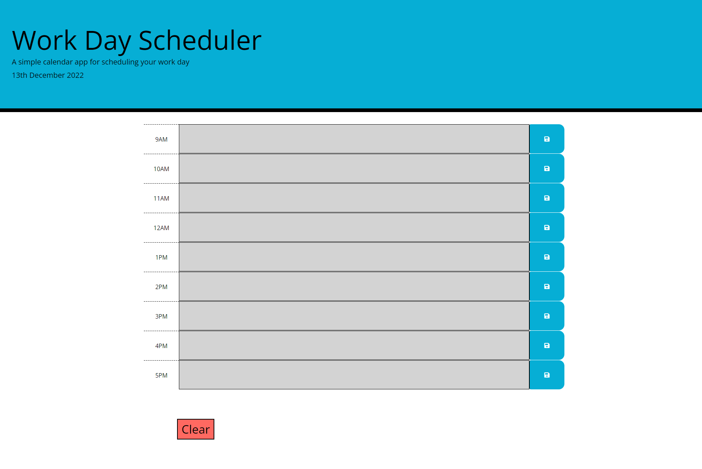
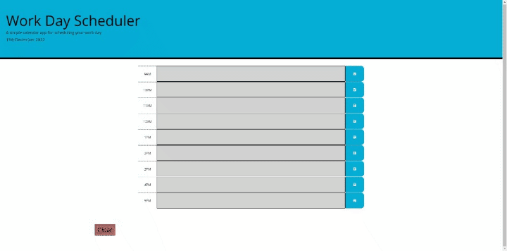

# Daily-Planner-App

## Description
Creation of a simple calendar application that allows a user to save events for each hour of the day.

## Table of contents
<ul>
    <li>User Story</li>
    <li>Acceptance Criteria</li>
    <li>Screenshot</li>
    <li>Demo</li>
    <li>Contributors</li>
    <li>Deployment</li>
    <li>Technologies</li>
    <li>Installation</li>
    <li>Usage</li>
    <li>Documentation</li>
    <li>License</li>
</ul>

## User Story
<pre>
    AS AN employee with a busy schedule
    I WANT to add important events to a daily planner
    SO THAT I can manage my time effectively
</pre>

## Acceptance Criteria
The app should:
<ul>
    <li>Display the current day at the top of the calendar when a user opens the planner.</li>
    <li>Present timeblocks for standard business hours when the user scrolls down.</li>
    <li>Color-code each timeblock based on past, present, and future when the timeblock is viewed.</li>
    <li>Allow a user to enter an event when they click a timeblock.</li>
    <li>Save the event in local storage when the save button is clicked in that timeblock.</li>
    <li>Persist events between refreshes of a page.</li>
</ul>
 

## Screenshot

 

## Demo

 

## Contributors
<ul>
    <li>Adam Sall - <a href="https://www.github.com/Kaiyfa">Kaiyfa</a> </li>
    <li>Chris-Eric Dagbo - <a href="https://www.github.com/cedagbo">cedagbo</a>  </li>
    <li>Lili Bengum - </li>
    <li>Vittoria Bugana - <a href="https://www.github.com/vbugana">vbugana</a> </li>
</ul>

## Deployment
<ul>
    <li>Website: https://cedagbo.github.io/Planner/ </li>
    <li>Repository: https://github.com/cedagbo/Daily-Planner-App </li>
</ul>

## Technologies

                   
 

## Installation
The use of this app does not require any software installation.

## Usage
<pre>
    1. Navigate to <a href="https://cedagbo.github.io/Planner/">the Deployed application</a> .
    2. Click on the field, and type the event you want to schedule.
    3. Use the floppy disk button next to the field to save the given event.
    4. Click on the clear button to remove all the events. 
</pre>

## Documentation
<ul>
    <li> https://getbootstrap.com/docs/4.0/getting-started/introduction/ </li>
    <li> https://momentjs.com/ </li>
    <li> https://www.w3schools.com/ </li>
    <li> https://www.traversymedia.com/ </li>
    <li> https://www.freecodecamp.org/news/ </li>
    <li> https://developer.mozilla.org/en-US/ </li>
    <li> https://jquery.com/ </li>
<ul>
 

## License
Daily Planner App is under MIT License.   
          
